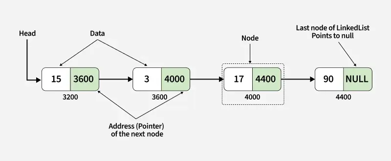

## Listas Ligadas

Listas ligadas são estruturas de dados compostas por nós.

Cada nó armazena:
- um valor/dado;
- uma referência (ponteiro) para outro nó da lista.

### Características:
- Não contíguo, ou seja, poderão não ser vizinhos sequencias de espaços na memória;
- Inserções e remoções podem ser eficientes;

### Estrutura básica de um nó

```java
class Node {
    int value;
    Node next;
}
```

